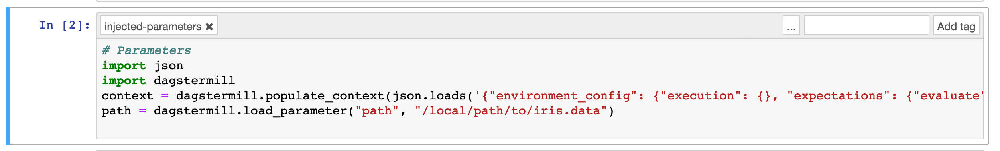

Data Science with Notebooks
--------------------------------------

   * :ref:`Notebooks as solids <notebooks_solids>`
   * :ref:`Expressing dependencies <expressing_dependencies>`
   * :ref:`Custom materializations and results <materializations_and_results>`

Fast iteration, the literate combination of arbitrary code with markdown blocks, and inline plotting
make notebooks an indispensible tool for data science. The Dagstermill package makes it
straightforward to run notebooks using the Dagster tools and to integrate them into data pipelines
with heterogeneous solids.

.. code-block:: shell

    $ pip install dagstermill

Our goal is to make it unnecessary to go through a tedious "productionization" process where code
developed in notebooks must be translated into some other (less readable and interpretable) format
in order to be integrated into production workflows. Instead, we can use notebooks as solids
directly, with minimal metadata declarations to integrate them into pipelines that may also contain
arbitrary heterogeneous solids.

.. _notebooks_solids:

Notebooks as solids
^^^^^^^^^^^^^^^^^^^
Let's consider the classic Iris dataset (:ref:`1 <1>`, :ref:`2 <2>`), collected in 1936 by the
American botanist Edgar Anderson and made famous by statistician Ronald Fisher. The Iris dataset is
a basic example in machine learning because it contains three classes of observation, one of which
is straightforwardly linearly separable from the other two, which in turn can only be distinguished
by more sophisticated methods.

  * `K-means clustering for the Iris data set <iris-kmeans.ipynb>`_.

Like many notebooks, this example does some fairly sophisticated work, producing diagnostic plots
and a (flawed) statistical model -- which are then locked away in the .ipynb format, can only
be reproduced using a complex Jupyter setup, and are only programmatically accessible within the
notebook context.

Once we turn our notebook into a solid, we can start to make its outputs more accessible.

.. literalinclude:: iris_pipeline.py
   :caption: iris_pipeline.py

This is the simplest form of notebook integration -- we don't actually have to make any changes in
the notebook itself to run it using the dagster tooling. Just run:

.. code-block:: shell

    dagit -f iris_pipeline.py -n define_iris_pipeline

What's more, every time we run the notebook from Dagit, a copy of the notebook `as executed` will
be written to disk and the path of this output notebook will be made available in Dagit:

.. image:: iris_output_notebook.png
   :scale: 50 %

The output notebook is both a rich log of notebook computations as they actually occurred, including
all inline plots and results, and also an important tool for interactive debugging. When a notebook
fails, the output notebook can be used to determine the cause of the failure.

.. _expressing_dependencies:

Expressing dependencies
^^^^^^^^^^^^^^^^^^^^^^^
Notebooks often have implicit dependencies on external state like data warehouses, filesystems, and
batch processes. For example, even in our simple Iris example we're making assumptions about data
that's available locally, in this case the ``iris.data`` file:

.. nbinput:: ipython3
   :execution-count: 2

    iris = pd.read_csv(
        'iris.data',
        ...
    )

The ability to express data dependencies between heterogeneous units of computation is core to
Dagster, and we can easily make notebooks depend on upstream solids.

We'll illustrate this process by adding a non-notebook solid to our pipeline, which will take care
of downloading the Iris data from the UCI repository.

.. literalinclude:: iris_pipeline_2.py
   :caption: iris_pipeline_2.py
   :emphasize-lines: 3, 5, 11, 17-22

We'll configure the ``download_file`` solid with the URL to download the file from, and the local
path at which to save it. This solid has one output, the path to the downloaded file. We'll want
to use this path in place of the hardcoded string when we read the csv in to our notebook:

.. nbinput:: ipython3
   :execution-count: 2

    iris = pd.read_csv(
        path,
        ...
    )

We need to make one more change to our notebook so that the ``path`` parameter is injected by the
Dagstermill machinery at runtime. Dagstermill uses Jupyter cell tags to identify which cell to
inject parameters into. In the `source notebook <iris-kmeans_2.ipynb>`_., this cell will look like
this:

.. image:: parameters.png

In the source notebook, we can give our parameters values that are useful for interactive
development (say, with a test dataset).

(To view Jupyter cell tags, select `Tags` in the `View / Cell Toolbar` menu in a notebook.)

.. image:: tags.png
   :scale: 35 %

Now we are ready to execute a heterogeneous data science pipeline, flowing the output of
arbitrary Python code into a notebook:

.. image:: iris_pipeline.png
   :scale: 40 %

We'll use the following config:

.. code-block:: yaml

    storage:
      filesystem:
    solids:
      download_file:
        config:
          path: 'iris.data'
          url: 'https://archive.ics.uci.edu/ml/machine-learning-databases/iris/iris.data'

When we execute this pipeline with Dagit, the ``parameters`` cell in the source notebook will be
dynamically replaced in the output notebook by a new ``injected-parameters`` cell.

.. _materializations_and_results:

The notebook context
^^^^^^^^^^^^^^^^^^^^

Linking notebooks together in pipelines
^^^^^^^^^^^^^^^^^^^^^^^^^^^^^^^^^^^^^^^
Persisted output notebooks are one important tool to checkpoint, debug, and retain notebooks as
executed in production. Typically, we'll also want to persist a variety of other outputs, such as
plots. We'll also often want to make our results available for downstream computation -- something
that's quite difficult using notebooks alone.

Materializations

Suppose that we have a couple of independent predictive efforts underway, and we'd like to validate
models against each other.

  * `K-neighbors Iris data set <iris-predictions.ipynb>`_.

  * `Cross-validating predictive models for the Iris data set <iris-predictions.ipynb>`_.

We'll introduce a second notebook, where we train some predictive models on the Iris data.

Custom materializations
^^^^^^^^^^^^^^^^^^^^^^^
Persisted output notebooks are one important tool to checkpoint, debug, and retain notebooks as
executed in production. Typically, we'll also want to persist a variety of other outputs, such as
plots. We'll also often want to make our results available for downstream computation -- something
that's quite difficult using notebooks alone.

Materializations

Suppose that we have a couple of independent predictive efforts underway, and we'd like to validate
models against each other.

  * `K-neighbors Iris data set <iris-predictions.ipynb>`_.

  * `Cross-validating predictive models for the Iris data set <iris-predictions.ipynb>`_.

We'll introduce a second notebook, where we train some predictive models on the Iris data.

.. _linking_notebooks:

- yield materialization
- yield result

.. _linking_notebooks:

- Registering with repository

.. _heterogeneous_workflows:

Heterogeneous data science workflows
^^^^^^^^^^^^^^^^^^^^^^^^^^^^^^^^^^^^

References
^^^^^^^^^^
.. _1:

1. Dua, D. and Graff, C. (2019). Iris Data Set. UCI Machine Learning Repository
   [https://archive.ics.uci.edu/ml/datasets/iris]. Irvine, CA: University of California,
   School of Information and Computer Science.

.. _2:

2. _Iris_ flower data set [https://en.wikipedia.org/wiki/Iris_flower_data_set]
